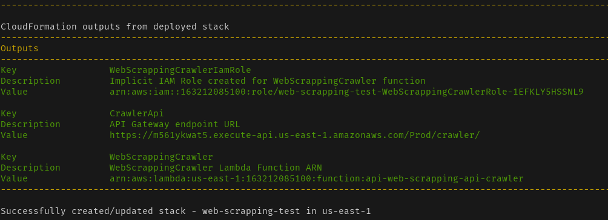

# TECHNICAL CHALLENGE

## The Challenge

We want to build a reference map on a website and understand which will be the most viewed by users when browsing.

For this we will make a crawler to help us get this information. Then, with the data obtained, we will train a model against historical data.

A crawler is a tool that allows us to enter a link and obtain information about it, for example, if the link is active or not.

In the case of this exercise, this software will allow us to evaluate the HTML response, parse it and obtain the links that are referenced within it.

In addition, this crawler will re-execute this procedure for each link it finds after this process, putting together a map like the following:

  

Our challenge will be to count the number of references (“appearences”) that we find of a link from other sources.

In the example case, the link https://www.google.com/doodles/ it has 2 "appearences", while https://google.com/ has 0 "appearences" (since no other page is referencing it).

Understanding that the growth of this process is exponential (and potentially infinite), at the beginning of the process will be defined a maximum degree of depth N, which we can reach. 

That is, we will stop the process when reaching the referenced link more than N steps after the initial link.

### First Part: Generation of Features

In the first instance, the objective is to build a project that has the ability to crawl the different links from a base set and persist, for each link, **how many different references (appearences)** of external pages were found. 

The maximum level, N, of depth of the crawler is defined at the beginning of the process:

  

In addition, this information can be enriched for each link with the information that it deems necessary to store.

Once the map is finished, for each link of the base set it is required to build a vector with at least 10 numerical characteristics based on said map, using the enrichment information previously obtained.

An example of a characteristic is "the number of characters in the link." 

These characteristics should only depend on information that can be obtained from the link -to be able to dynamically load them later-.

This vector must be saved in a new storage instance (table, document, file, etc):

  

Each of these vectors must be persisted in the type of persistence that the user defines -unless it is forced by the conditions of the exercise-.

Finally, a REST API will be built such that it uses the defined storage and allows **obtaining the vector of features associated with a link**:

- If the link is in the database, answer the precalculated vector.
- If the link is not found in the database, the values corresponding to the vector must be calculated, inserted into the database and then returned. This vector will not have the number of external references calculated.

## My Achievements

I build the crawler from scratch, this crawler can be access in [src/crawler_job/main.py](./src/crawler_job/main.py) file.

**There are some warnings about this crawler script.**

- The crawler script is slow and supports no parallelism. As can be seen from the timestamps, it takes about one second to crawl each URL. Each time the crawler makes a request it waits for the request to be resolved and no work is done in between.
- There is no retry mechanism, the URL queue is not a real queue and not very efficient with a high number of URLs.
- The link extraction logic doesn’t support standardizing URLs by removing URL query string parameters, doesn’t handle URLs starting with #, doesn’t support filtering URLs by domain or filtering out requests to static files.
- The crawler doesn’t identify itself and ignores the robots.txt file.

All of this limitation could be solved by using Scrapy, I have an example of crawler using Scrapy that can be access [here](https://github.com/whrocha/web-scrapping-challenge).

I build a Jupyter Notebook that analyse the crawler output.

Jupyter Notebook can be access in [src/crawler_job/vector-analytics.ipynb](./src/crawler_job/vector-analytics.ipynbvector-analytics.ipynb).

## Run Crawler and API

### Build Stack

This project was built on top AWS, so you need to have a valid AWS Account to run this project.

#### About SAM

AWS SAM provides you with a command line tool, the AWS SAM CLI, that makes it easy for you to create and manage serverless applications. You need to install and configure a few things in order to use the AWS SAM CLI. [Install SAM](https://docs.aws.amazon.com/serverless-application-model/latest/developerguide/serverless-sam-cli-install.html)

**Homebrew**

To install the AWS SAM CLI using Homebrew, run the following commands:

```
brew tap aws/tap
brew install aws-sam-cli
```

Verify the installation.

```
sam --version
Homebrew 3.1.8
Homebrew/homebrew-core (git revision 94d77888152; last commit 2021-05-22)
```

#### Deploy stack

To deploy this stack project go to [cloudformation/](./cloudformation/).

Run

```
make deploy
```

If everything works fine you will have the following output



**Save the CrawlerAPI endpoint URL it will be used to test the API Calls !!!**

if you already clean-up your terminal, just run the command bellow in `cloudformation` folder

```
make deploy
```

And the de url API endpoint, in my example above is `https://m561ykwat5.execute-api.us-east-1.amazonaws.com/Prod/crawler/ `

### Run Crawler

The Crawler can be access in [src/crawler_job/](./src/crawler_job/)

To run this project to the following

**Create virtual environment**

```
virtualenv -p python3.8 venv
```

**Active Virtual Environment**

```
source venv/bin/activate
```

**Install necessary libs**

```
pip install -r requirements.txt
```

**Run crawler**

```
python main.py
```

This Script will scrawl the URL and save in dynamodb previouslly deployed, to crawl others URLs just change the variable URLS in `main.py` script.

```
URLS = [
    'https://scrapethissite.com/',
    'http://www.example.com/',
]
```

### Test API

You can test the API enpoint, in my example the url endpoint is `https://m561ykwat5.execute-api.us-east-1.amazonaws.com/Prod/crawler/`.

The API call could be done using `curl`.

```
curl https://m561ykwat5.execute-api.us-east-1.amazonaws.com/Prod/crawler/?url=https://www.iana.org/domains/example

{"qty_bytes_response": {"N": "10350"}, "qty_page_http_links": {"N": "7"}, "qty_character_url": {"N": "36"}, "qty_h1_page": {"N": "1"}, "qty_page_internal_links": {"N": "61"}, "qty_total_table_tr": {"N": "16"}, "qty_total_table": {"N": "2"}, "qty_character_page_title": {"N": "36"}, "qty_total_table_td": {"N": "52"}, "link": {"S": "https://www.iana.org/domains/example"}, "appearences": {"N": "1"}, "qty_total_a": {"N": "68"}}
```

Or you can use the api_test script that could be find in [src/api_test](./src/api_test/)

In `main.py` you can put your API endpoint URL and which URL you want to search, if the URL does not exists yet, it will just return the metrics related to url itself, for example the url characters quantity

```
python main.py
```

## Cloud Stack Diagram

